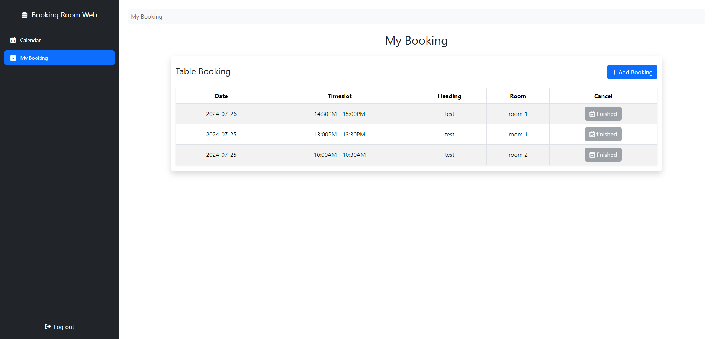

# PHP Booking Rooms

Create PHP Booking Rooms with using:

- HTML
- CSS
- JavaScript
- PHP (PDO)
- SQL

 

## Login
 

 

## User
 

 

## My booking
 

 

## Dashboard
 

 

## Dashboard booking (same user)
 

 

## Dashboard booking form (same user)
 

 

## Dashboard my booking
 

 

## Dashboard employee
 

 

## Dashboard rooms
 

 

## Dashboard setting
 

 
